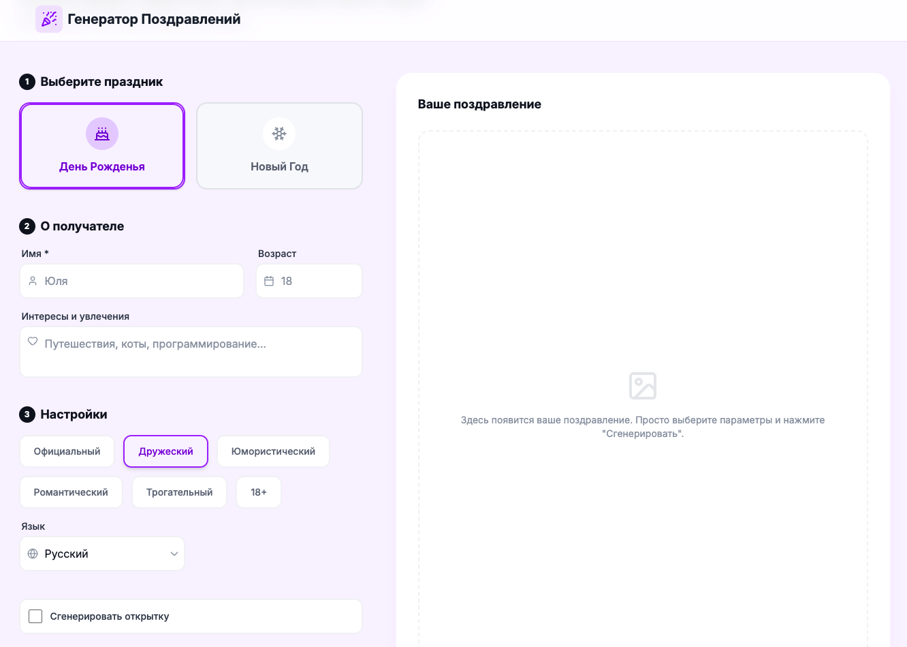

# NeuroGreet: AI-генератор поздравлений

**NeuroGreet** — это интерактивное веб-приложение, которое использует возможности искусственного интеллекта Google Gemini для создания уникальных, персонализированных поздравлений.

Итак, в чем суть приложения?

Пользователь проходит простой путь из нескольких шагов:

1.  Выбирает повод (День Рождения, Новый Год и т.д.).
2.  Указывает данные получателя (имя, возраст, интересы).
3.  Настраивает стиль поздравления (тон, язык).
4.  При желании активирует генерацию визуальной открытки.

В результате пользователь получает готовый текст поздравления и (опционально) уникальное изображение, сгенерированное нейросетью.

## Технологический стек

- **Frontend Framework:** React 19
- **Язык программирования:** TypeScript
- **Стилизация:** Tailwind CSS (для быстрой и адаптивной верстки)
- **Иконки:** Lucide React
- **Линтинг и Форматинг:** ESLint + Prettier
- **AI API:** Google Gemini API (библиотека `@google/genai`)
  - Модель для текста: `gemini-2.5-flash`
  - Модель для изображений: `gemini-2.5-flash-image`
- **Сборка/Среда:** Vite
- **Деплой:** Render

### Запуск приложения

- npm install (установка зависимостей)
- npm run dev (запуск приложения)
- npm run build (сборка приложения)
- npm run preview (запуск собранного приложения)

